# 📱 GreenAgro — App Flow Document

> **A visual guide to the GreenAgro user journey, navigation, key screens and intelligence flows**

---

## 01 — App Overview

| Field | Details |
|---|---|
| **App Name** | GreenAgro |
| **Assistant** | AI Saarthi |
| **Primary User** | Farmer |
| **Secondary Users** | Agricultural experts / knowledge contributors |
| **Platforms** | Responsive Web |
| **Desktop Navigation** | Persistent Sidebar + Top Header |
| **Mobile Navigation** | Compact Header + Bottom Navigation |
| **Core Experience** | Observe → Understand → Advise → Regenerate |

---

## 02 — Entry Flow

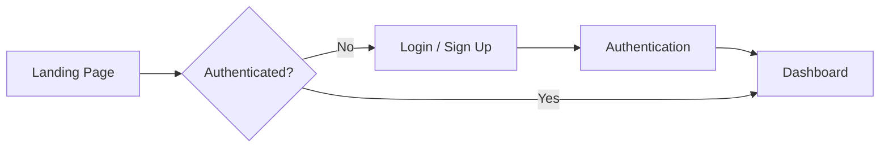

---

## 03 — Main Application Navigation

### Desktop

```text
┌─────────────────────────────────────────────────────────┐
│ GreenAgro Header                                        │
├───────────────┬─────────────────────────────────────────┤
│ Dashboard     │                                         │
│ My Farm       │                                         │
│ Satellite     │             PAGE CONTENT               │
│ Soil Health   │                                         │
│ Weather       │                                         │
│ Disease       │                                         │
│ Regenerative  │                                         │
│ AI Saarthi    │                                         │
│ Knowledge     │                                         │
│ Settings      │                                         │
└───────────────┴─────────────────────────────────────────┘
```

### Mobile

```text
┌──────────────────────────────┐
│ GreenAgro        Profile     │
├──────────────────────────────┤
│                              │
│        PAGE CONTENT          │
│                              │
│                              │
├──────────────────────────────┤
│ Home │ Farm │ Insights │ AI │ More │
└──────────────────────────────┘
```

---

## 04 — Complete User Journey

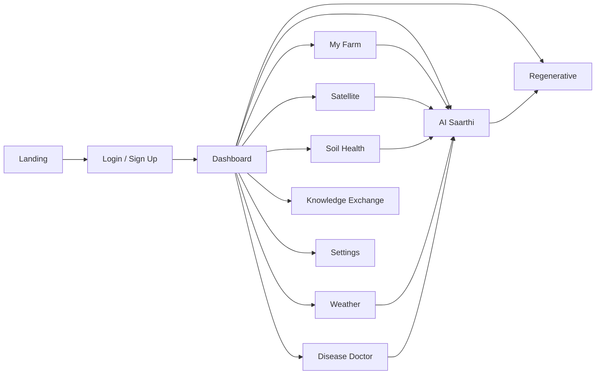

---

## 05 — Screen 01: Landing Page

**Route:** `/`

### Purpose

Introduce GreenAgro and communicate the value proposition.

### Main Content

- GreenAgro branding
- “Smarter Farming. Healthier Tomorrow.”
- Farmer-focused hero
- Core feature cards
- Intelligence loop
- AI / satellite / soil / weather overview
- Call-to-action

### Flow

```text
Landing
  ↓
Understand GreenAgro
  ↓
Explore Features
  ↓
Sign Up / Login
```

---

## 06 — Screen 02: Login / Sign Up

**Route:** `/login`

### Authentication Options

- Email/password
- Google OAuth
- Phone-ready architecture

### Flow

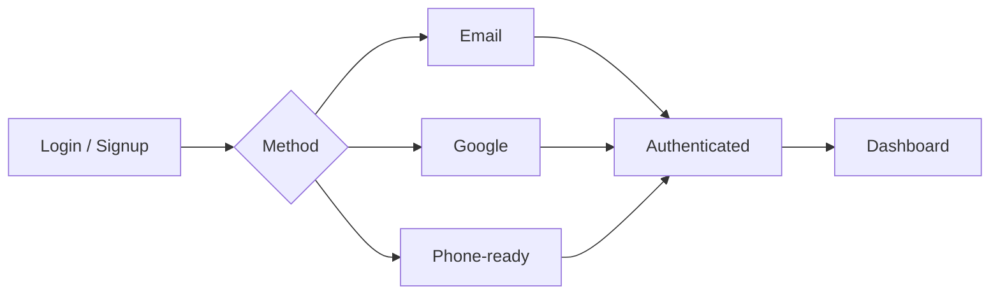

---

## 07 — Screen 03: Farmer Dashboard

**Route:** `/app`

### Purpose

The dashboard is the central farm intelligence overview.

### Information Areas

- Temperature
- Rain
- Crop health
- Disease risk
- Irrigation
- Soil
- Vegetation
- Forecast
- Today's recommendation
- Quick actions

### Dashboard Flow

```text
Farm Context
     ↓
┌──────────┬──────────┬──────────┐
│ Weather  │   Soil   │Vegetation│
└──────────┴──────────┴──────────┘
     ↓
Disease / Crop Context
     ↓
Today's Recommendation
     ↓
Quick Action
```

---

## 08 — Screen 04: My Farm

**Route:** `/app/farm`

### Purpose

Maintain the user's farm and field context.

### Information

- Farm profile
- Farm size
- Crop
- Soil
- Irrigation
- Location
- Field boundary
- Interactive map

### Flow

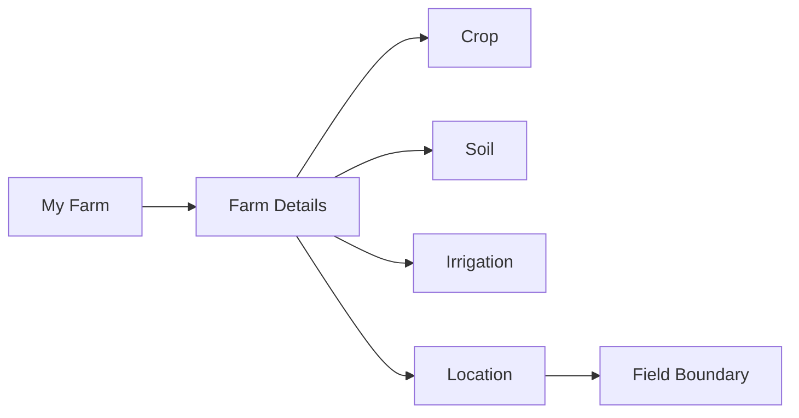

---

## 09 — Screen 05: Satellite Intelligence

**Route:** `/app/satellite`

### Purpose

Translate satellite vegetation information into understandable farm context.

### Flow

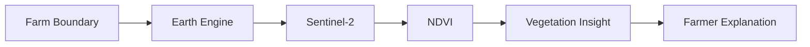

### UI Areas

- Field / map view
- Vegetation visualization
- NDVI information
- Historical trend where available
- Explanation
- Provider status

---

## 10 — Screen 06: Soil Health

**Route:** `/app/soil`

### Purpose

Help users understand structured soil indicators.

### Indicators

- Nitrogen
- Phosphorus
- Potassium
- pH
- Organic Carbon

### Flow

```text
Soil Data
   ↓
Validation
   ↓
Soil Analysis
   ↓
Status / Interpretation
   ↓
AI Explanation
   ↓
Suggested Action
```

---

## 11 — Screen 07: Weather Forecast

**Route:** `/app/weather`

### Purpose

Provide local weather context.

### Information

- Temperature
- Rain information
- Forecast
- Weather alerts
- Agricultural context

### Flow

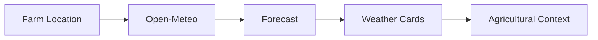

---

## 12 — Screen 08: Disease Doctor

**Route:** `/app/disease`

### Purpose

Provide AI-assisted crop / leaf image analysis.

### User Flow

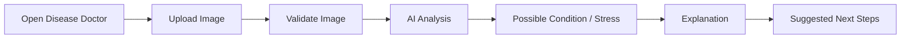

### Important UX

The result should communicate uncertainty appropriately and should not claim laboratory confirmation.

---

## 13 — Screen 09: Regenerative Agriculture

**Route:** `/app/regenerative`

### Purpose

Turn agricultural intelligence into long-term sustainable action.

### Practice Areas

- Soil cover
- Reduced soil disturbance
- Crop diversification
- Water conservation
- Nutrient management
- Irrigation efficiency
- Soil organic matter
- Rangeland / livestock management

### Flow

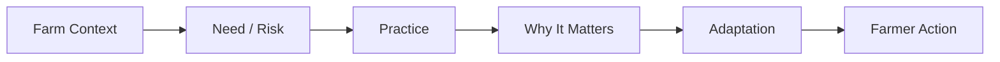

---

## 14 — Screen 10: AI Saarthi

**Route:** `/app/ai`

### Purpose

Conversational agricultural assistance.

### Conversation Flow

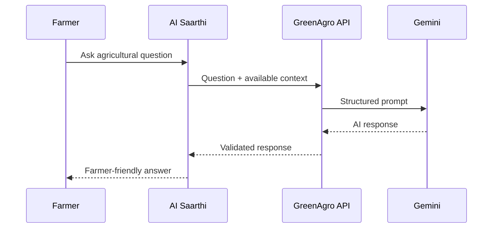

### Example

```text
Farmer:
"My wheat leaves are turning yellow.
What should I check?"

AI Saarthi:
Uses available crop + soil + weather context,
explains possible factors,
and suggests practical checks.
```

---

## 15 — Screen 11: BRICS Knowledge Exchange

**Route:** `/app/knowledge`

### Purpose

Share and explore documented agricultural practices across BRICS countries.

### Current Knowledge Areas

```text
🇮🇳 India
Khadin Runoff Farming

🇧🇷 Brazil
No-Tillage with Cover Crops

🇷🇺 Russia
No-Till Winter Wheat

🇨🇳 China
Hani Rice Terraces

🇿🇦 South Africa
Rotational Grazing
```

### Detail Flow

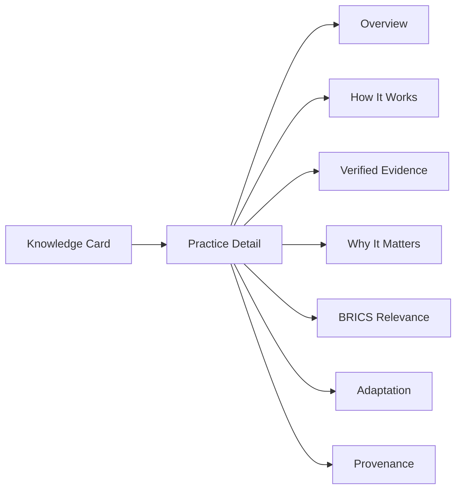

---

## 16 — Screen 12: Settings

**Route:** `/app/settings`

### Profile

- Full name
- Phone
- Location
- Language
- Profile photo

### Preferences

- Weather alerts
- Disease alerts
- Weekly reports
- Market updates

### Flow

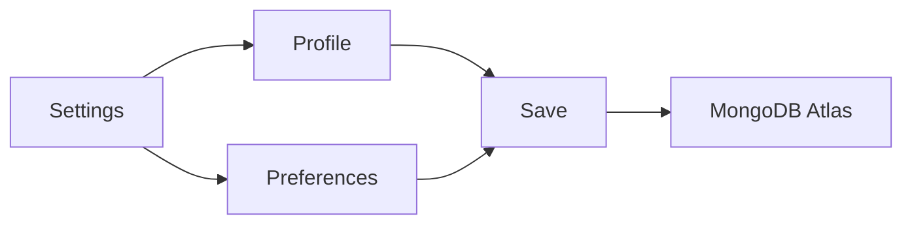

---

## 17 — Cross-Module Intelligence Flow

This is the most important product flow.

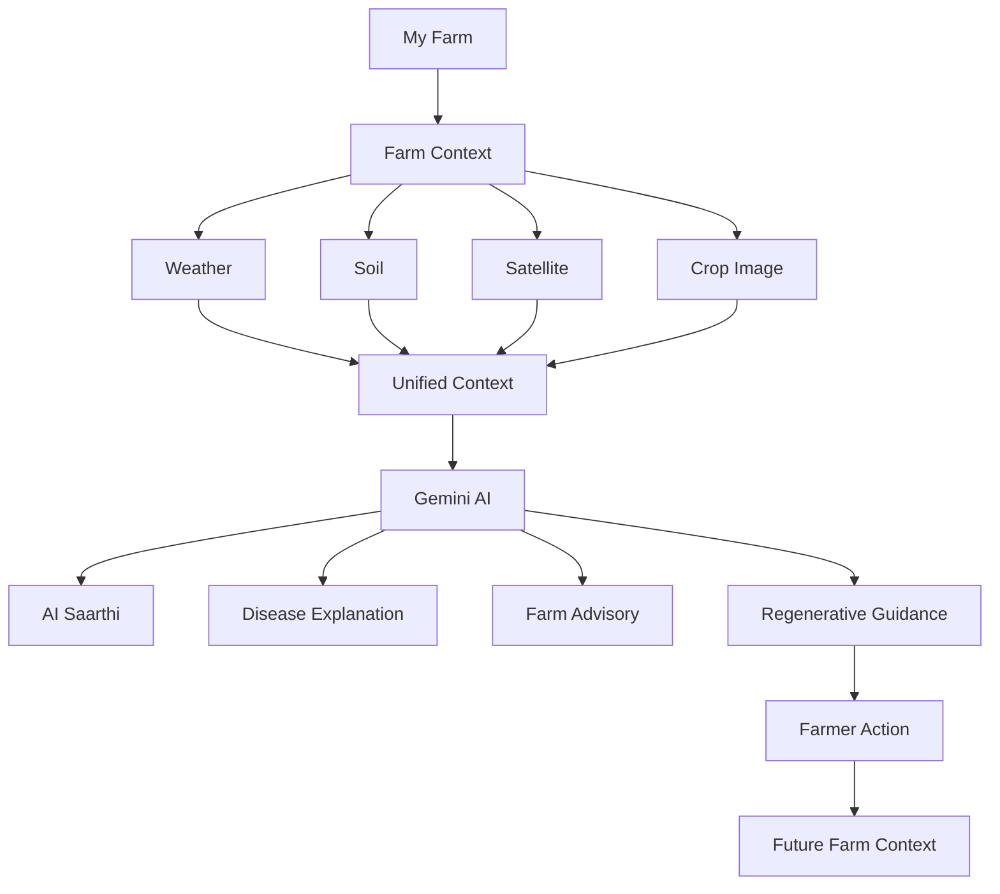

---

## 18 — Navigation Matrix

| Screen | Primary Entry | Main Exit |
|---|---|---|
| Landing | Public | Login |
| Login | Landing | Dashboard |
| Dashboard | Login | All modules |
| My Farm | Dashboard | Dashboard / AI |
| Satellite | Dashboard | Dashboard / AI |
| Soil | Dashboard | Dashboard / AI |
| Weather | Dashboard | Dashboard / AI |
| Disease | Dashboard | AI / Advisory |
| Regenerative | Dashboard | Farm / AI |
| AI Saarthi | Dashboard / modules | Any module |
| Knowledge | Dashboard | Practice detail |
| Settings | Profile / More | Dashboard |

---

## 19 — Error & Loading States

Every data-driven screen should support:

### Loading

```text
Loading
   ↓
Skeleton / Spinner
   ↓
Content
```

### Error

```text
Request
   ↓
Provider Error
   ↓
Friendly Message
   ↓
Retry / Continue
```

### Empty State

```text
No Data
   ↓
Explain Why
   ↓
Tell User What To Do Next
```

---

## 20 — Mobile Safety Rules

The mobile application must ensure:

- Fixed bottom navigation does not cover content.
- Page content has adequate bottom padding.
- Maps remain scrollable.
- Floating AI controls avoid important buttons.
- Cards do not overflow horizontally.
- Long tables have safe horizontal scrolling.
- Upload controls remain accessible.

---

## 21 — End-to-End Farmer Story

```text
Farmer opens GreenAgro
        ↓
Signs in
        ↓
Configures farm
        ↓
Views dashboard
        ↓
Checks weather
        ↓
Checks soil
        ↓
Checks vegetation
        ↓
Uploads crop image
        ↓
Gets AI interpretation
        ↓
Asks AI Saarthi
        ↓
Receives contextual advisory
        ↓
Explores regenerative action
        ↓
Learns from BRICS practices
        ↓
Takes action
        ↓
Returns to farm context
```

---

## 22 — Core Product Loop

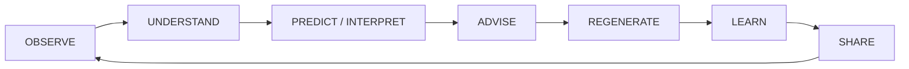

---

# 🌾 GreenAgro

## Smarter Farming. Healthier Tomorrow.

**AI × Agriculture × Regenerative Intelligence × BRICS Cooperation**
