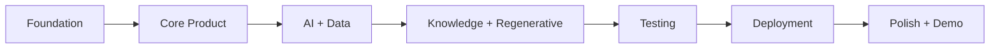
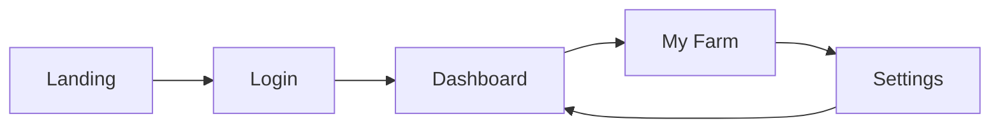
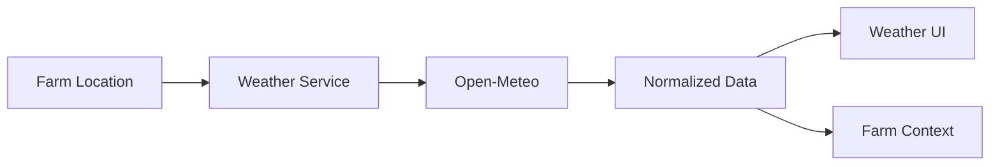
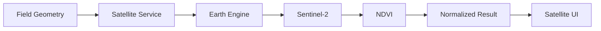
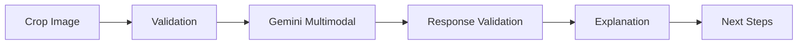
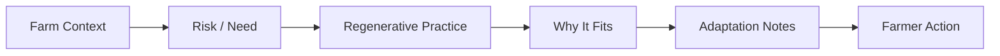
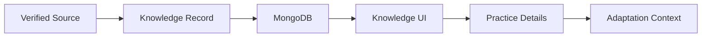
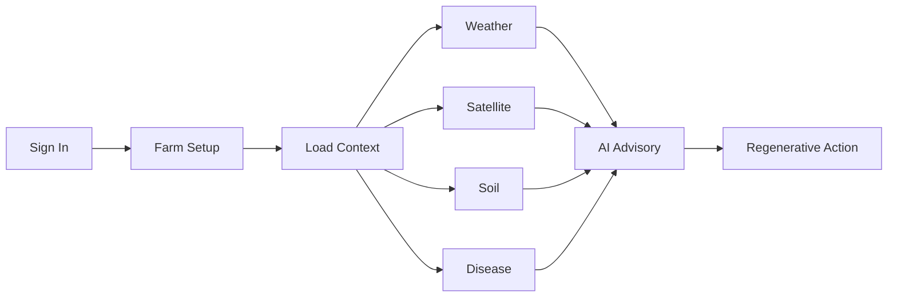
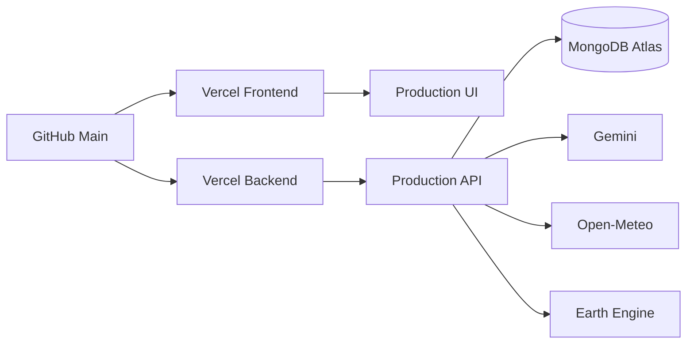

# 🚀 GreenAgro — Implementation Plan

> **A practical implementation roadmap for building, validating, deploying and improving GreenAgro**

---

## 01 — Implementation Overview

| Item | Details |
|---|---|
| **Product** | GreenAgro |
| **Team** | LakeCity Coders |
| **Approach** | Incremental full-stack implementation |
| **Frontend** | React + TypeScript + Vite |
| **Backend** | Node.js + Express + TypeScript |
| **Database** | MongoDB Atlas |
| **AI** | Google Gemini |
| **Weather** | Open-Meteo |
| **Satellite** | Google Earth Engine |
| **Deployment** | Separate Vercel frontend + backend |

The implementation strategy prioritizes the working farmer journey first, then expands integrations, knowledge exchange, reliability and production hardening.

---

## 02 — Implementation Strategy



### Delivery Principle

> Build the critical farmer journey first. Add intelligence and integrations around that journey. Validate every external dependency before presenting it as live.

---

## 03 — Phase 1: Foundation

### Objectives

- Establish repository structure.
- Configure frontend and backend.
- Configure TypeScript.
- Configure environment handling.
- Establish API communication.
- Establish MongoDB Atlas connection.
- Establish base authentication.

### Deliverables

```text
Repository
   ↓
Frontend
   ↓
Backend
   ↓
MongoDB
   ↓
Authentication
   ↓
Base Dashboard
```

### Checklist

- [x] React + Vite application
- [x] Express API
- [x] TypeScript
- [x] Environment configuration
- [x] MongoDB integration
- [x] JWT authentication
- [x] Google OAuth architecture

---

## 04 — Phase 2: Farmer Core

### Objectives

Build the screens a farmer uses most frequently.

### Deliverables

1. Landing page
2. Login / Sign Up
3. Farmer Dashboard
4. My Farm
5. Settings

### Farmer Journey



### Validation

- Authentication persists.
- User profile persists.
- Farm context loads.
- Mobile navigation works.
- Dashboard has useful loading/error states.

---

## 05 — Phase 3: Weather Intelligence

### Objectives

Integrate Open-Meteo and normalize weather information.

### Tasks

- Implement weather provider.
- Map farm location to weather request.
- Normalize provider response.
- Add forecast cards.
- Add weather-related agricultural context.
- Handle provider errors.

### Flow



### Acceptance Criteria

- Forecast loads.
- Loading state works.
- Error state works.
- No fake live weather is shown when provider fails.

---

## 06 — Phase 4: Soil Health

### Objectives

Create structured soil input and interpretation.

### Tasks

- Define soil schema.
- Add validation.
- Normalize units / ranges.
- Calculate deterministic indicators where applicable.
- Display soil status.
- Send structured context to AI.

### Flow

```text
Soil Input
   ↓
Validation
   ↓
Normalization
   ↓
Deterministic Analysis
   ↓
Soil Context
   ↓
Gemini Explanation
```

---

## 07 — Phase 5: Satellite Intelligence

### Objectives

Connect Earth Engine and Sentinel-2 / NDVI.

### Tasks

- Configure Earth Engine project.
- Configure service account credentials securely.
- Implement provider abstraction.
- Validate farm geometry.
- Query supported satellite imagery.
- Process NDVI.
- Normalize satellite response.
- Display vegetation information.
- Handle unavailable provider state.

### Architecture



### Critical Rule

Never replace unavailable live satellite information with an unlabeled fabricated value.

---

## 08 — Phase 6: Disease Doctor

### Objectives

Implement multimodal crop / leaf analysis.

### Tasks

- Build upload UI.
- Validate image type and size.
- Send image to AI service.
- Validate response.
- Display possible condition / stress interpretation.
- Display suggested next steps.
- Add uncertainty / safety language.

### Flow



---

## 09 — Phase 7: AI Saarthi

### Objectives

Create the contextual agricultural assistant.

### Tasks

- Build chat interface.
- Load authenticated user context.
- Load farm context where available.
- Construct contextual prompts.
- Support English / Hindi where configured.
- Handle loading state.
- Handle malformed AI output.
- Keep external measurements grounded in actual provider data.

### Example

```text
Farmer Question
      ↓
User + Farm Context
      ↓
Prompt Construction
      ↓
Gemini
      ↓
Validated Response
      ↓
Farmer-Friendly Answer
```

---

## 10 — Phase 8: Regenerative Intelligence

### Objectives

Connect farm intelligence to sustainable action.

### Tasks

- Define regenerative practice records.
- Categorize by soil / water / crop / livestock context.
- Create recommendation logic.
- Explain why a practice may be relevant.
- Add adaptation notes.
- Avoid universal claims.

### Flow



---

## 11 — Phase 9: BRICS Knowledge Exchange

### Objectives

Build the cooperation layer.

### Initial Knowledge Set

| Country | Practice |
|---|---|
| 🇮🇳 India | Khadin Runoff Farming |
| 🇧🇷 Brazil | No-Tillage with Cover Crops |
| 🇷🇺 Russia | No-Till Winter Wheat |
| 🇨🇳 China | Hani Rice Terraces |
| 🇿🇦 South Africa | Rotational Grazing |

### Tasks

- Create knowledge schema.
- Seed / upsert records.
- Add provenance.
- Add country / crop tags.
- Add image references.
- Add detail modal.
- Add verified evidence section.
- Add adaptation section.
- Add likes / views if supported.

### Knowledge Flow



---

## 12 — Phase 10: Settings & Persistence

### Tasks

- Profile update API.
- Full name.
- Phone.
- Location.
- Language.
- Avatar.
- Alert preferences.
- Weekly report preference.
- Market update preference.

### Persistence Flow

```text
Settings UI
   ↓
PUT /api/auth/profile
   ↓
Validation
   ↓
User Model
   ↓
MongoDB Atlas
   ↓
Updated Session / Profile
```

---

## 13 — Phase 11: Responsive Polish

### Desktop Checklist

- [ ] Sidebar works on all protected pages.
- [ ] Cards maintain consistent spacing.
- [ ] Maps fit available content area.
- [ ] No unnecessary horizontal scrolling.

### Mobile Checklist

- [ ] Bottom navigation stays accessible.
- [ ] Content has safe bottom spacing.
- [ ] No fixed element covers important content.
- [ ] Cards stack correctly.
- [ ] Tables / charts remain usable.
- [ ] AI floating button does not cover actions.

---

## 14 — Phase 12: Testing

### Test Matrix

| Area | Test |
|---|---|
| Auth | Login, signup, Google OAuth |
| Profile | Save / reload profile |
| Farm | Create / update / load context |
| Weather | Provider response and failure |
| Satellite | Geometry, credentials, provider response |
| Soil | Validation and calculations |
| Disease | File validation and AI response |
| AI | Context, malformed response, errors |
| Knowledge | Load, detail, likes |
| Mobile | Navigation and overlap |
| Security | Authorization and secret exposure |
| E2E | Complete farmer journey |

### End-to-End Flow



---

## 15 — Phase 13: Production Configuration

### Frontend

```env
VITE_API_BASE_URL=https://greenagro-api.vercel.app/api
```

### Backend

```env
NODE_ENV=production
FRONTEND_URL=https://green-agro-ruby.vercel.app
MONGODB_URI=...
JWT_SECRET=...
GEMINI_API_KEY=...
GOOGLE_CLIENT_ID=...
GOOGLE_CLIENT_SECRET=...
GOOGLE_CALLBACK_URL=https://greenagro-api.vercel.app/api/auth/google/callback
SATELLITE_PROVIDER=earth-engine
EARTH_ENGINE_PROJECT=...
EARTH_ENGINE_CREDENTIALS_JSON=...
```

---

## 16 — Phase 14: Deployment



### Deployment Checklist

- [ ] Production environment variables configured.
- [ ] Frontend production API URL configured.
- [ ] Backend CORS configured.
- [ ] MongoDB connection verified.
- [ ] Google OAuth production redirect configured.
- [ ] Gemini configured.
- [ ] Earth Engine configured.
- [ ] Production health endpoint checked.
- [ ] Frontend and backend communication tested.

---

## 17 — Phase 15: Demo Readiness

### Recommended Demo Order

```text
Problem
  ↓
GreenAgro Landing
  ↓
My Farm
  ↓
Weather
  ↓
Satellite
  ↓
Soil
  ↓
Disease Doctor
  ↓
AI Saarthi
  ↓
Regenerative Action
  ↓
BRICS Knowledge Exchange
  ↓
Impact / Vision
```

### Demo Rule

Use real working flows wherever available.

If an external provider is unavailable, clearly label its state instead of presenting it as live.

---

## 18 — Implementation Risks

| Risk | Mitigation |
|---|---|
| Earth Engine credentials | Secure Vercel backend environment |
| Provider timeout | Timeout + clear error state |
| AI malformed response | Schema validation |
| OAuth state mismatch | Signed state validation |
| Mobile overlap | Page-level safe bottom spacing |
| API unavailable | Loading / error states |
| Incorrect AI assumptions | Structured context + deterministic data |
| Secret exposure | Environment variables + Git ignore |

---

## 19 — Final Definition of Done

```text
Authentication
      ↓
Farm Context
      ↓
Weather
      ↓
Satellite
      ↓
Soil
      ↓
Disease
      ↓
Gemini
      ↓
Advisory
      ↓
Regenerative Action
      ↓
BRICS Knowledge
      ↓
Production Deployment
      ↓
Demo Ready
```

A release is ready when the critical farmer journey works end-to-end and unavailable external services are represented honestly through explicit states.
