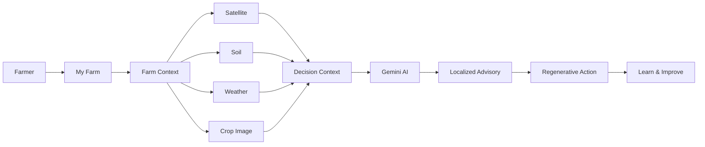

# 🌱 GreenAgro — Product Requirements Document

> **Smarter Farming. Healthier Tomorrow.**  
> **AI-Powered Regenerative Agricultural Intelligence Platform**  
> **Track 4 — AgriN & Regenerative Agricultural Intelligence | BRICS Theme: Cooperation**

---

## 01 — Product Overview

| Field | Details |
|---|---|
| **Product Name** | GreenAgro |
| **Core Assistant** | AI Saarthi |
| **Product Type** | Farmer-facing agricultural intelligence web platform |
| **Primary Market** | India-first, designed for expansion across BRICS contexts |
| **Primary Users** | Farmers, agricultural experts, administrators / knowledge contributors |
| **AI Platform** | Google Gemini |
| **Database** | MongoDB Atlas |
| **Weather** | Open-Meteo |
| **Satellite** | Google Earth Engine + Sentinel-2 / NDVI |
| **Frontend** | React + TypeScript + Vite + Tailwind CSS |
| **Backend** | Node.js + Express + TypeScript |
| **Deployment** | Separate Vercel frontend and backend |

---

## 02 — Product Vision

GreenAgro brings fragmented agricultural signals into one understandable decision-support experience.

The product combines:

- 🛰️ Satellite intelligence
- 🌱 Soil information
- 🌦️ Weather context
- 📷 Crop / leaf image analysis
- 🤖 Gemini-powered reasoning
- ♻️ Regenerative agriculture guidance
- 🌍 BRICS agricultural knowledge

### Product Principle

> **Do not only show agricultural data. Explain what it means in the farmer's context and help turn it into an actionable next step.**

---

## 03 — Problem Statement

Farmers may need to consult different sources for weather, soil, crop health, satellite information and farming practices. These sources can be difficult to interpret together.

### Key Problems

- Agricultural information is fragmented across different tools.
- Weather data often lacks farm-specific agricultural context.
- Satellite imagery can be technically difficult for non-specialist users.
- Soil information needs interpretation before it becomes a useful action.
- Crop symptoms may require visual analysis plus environmental context.
- Generic chatbots may answer questions without structured farm context.
- Sustainable practices are often documented separately from day-to-day farm decisions.
- Useful agricultural practices from different countries are not always presented in an accessible, comparable format.

---

## 04 — Product Goals

### Primary Goals

1. Provide a unified farm intelligence dashboard.
2. Combine multiple agricultural data sources into structured farm context.
3. Use Google Gemini for meaningful contextual reasoning.
4. Make satellite and environmental information understandable.
5. Provide AI-assisted crop / leaf analysis.
6. Recommend regenerative actions alongside conventional farm guidance.
7. Provide a verified BRICS agricultural knowledge exchange.
8. Support an India-first, multilingual and scalable architecture.

### Non-Goals

GreenAgro is not intended to:

- Replace agricultural officers or agronomists.
- Replace laboratory disease diagnosis.
- Claim certainty when source data is missing.
- Present fabricated live satellite, soil or weather measurements.
- Treat one research result as universally applicable to every farm.

---

## 05 — Target Users

### 👨‍🌾 Farmer

Needs simple answers to questions such as:

- What is happening with my crop?
- What does today's weather mean for my farm?
- What should I check in my soil?
- What can I do after seeing a crop symptom?
- Which sustainable practice could fit my situation?

### 🧑‍🔬 Agricultural Expert

Needs:

- Structured farm context
- Data provenance
- Explainable AI output
- Knowledge references
- Ability to interpret recommendations alongside source information

### 🏛️ Knowledge / Administration User

Needs:

- Structured agricultural practices
- Country and crop categorization
- Source provenance
- Knowledge exchange across regions

---

## 06 — Core Product Journey



### Intelligence Loop

```text
OBSERVE
   ↓
UNDERSTAND
   ↓
PREDICT / INTERPRET
   ↓
ADVISE
   ↓
REGENERATE
   ↓
LEARN
   ↓
SHARE
```

---

## 07 — Functional Requirements

### FR-01 — Authentication

The system shall support:

- Email/password authentication.
- Google OAuth.
- JWT-based application sessions.
- User profile persistence.
- Secure OAuth state validation.

### FR-02 — Farm Profile

A user shall be able to maintain:

- Farm name / profile
- Location
- Crop
- Farm size
- Soil information
- Irrigation information
- Field boundary / map context where configured

### FR-03 — Dashboard

The dashboard shall provide a consolidated view of available farm intelligence, including:

- Weather
- Rain information
- Crop health context
- Disease risk context
- Irrigation
- Soil
- Vegetation
- Recommendations
- Quick actions

### FR-04 — Satellite Intelligence

The system shall:

- Accept farm / field geometry where configured.
- Use Earth Engine through a provider abstraction.
- Work with Sentinel-2 vegetation information.
- Calculate / expose NDVI-derived information where available.
- Clearly indicate a not-configured or unavailable provider state.

### FR-05 — Weather

The system shall:

- Fetch weather information through Open-Meteo.
- Associate weather context with the farm location.
- Present forecast information in a farmer-friendly interface.

### FR-06 — Soil Health

The system shall support structured soil indicators such as:

- Nitrogen
- Phosphorus
- Potassium
- pH
- Organic Carbon

### FR-07 — Disease Doctor

The system shall:

- Accept crop / leaf images.
- Validate uploaded files.
- Send supported images to multimodal AI.
- Return structured interpretation.
- Provide safety-aware next steps.
- Avoid presenting AI output as laboratory confirmation.

### FR-08 — AI Saarthi

The assistant shall:

- Accept natural-language questions.
- Use available farm context where appropriate.
- Explain agricultural concepts.
- Provide contextual recommendations.
- Support multilingual interaction where configured.

### FR-09 — Regenerative Agriculture

The system shall surface sustainable practices involving:

- Soil cover
- Reduced soil disturbance
- Crop diversification
- Water conservation
- Nutrient management
- Responsible irrigation
- Soil organic matter
- Rangeland / livestock management

### FR-10 — BRICS Knowledge Exchange

The system shall provide structured agricultural knowledge records with:

- Country
- Practice
- Region
- Crop / farming context
- Description
- Practice details
- Expected benefit
- Adaptation notes
- Tags
- Source / provenance

---

## 08 — Knowledge Exchange Scope

| Country | Practice | Main Learning Area |
|---|---|---|
| 🇮🇳 India | Khadin Runoff Farming | Runoff and water management |
| 🇧🇷 Brazil | No-Tillage with Cover Crops | Soil conservation |
| 🇷🇺 Russia | No-Till Winter Wheat | Soil moisture / conservation tillage |
| 🇨🇳 China | Hani Rice Terraces | Water management and biodiversity |
| 🇿🇦 South Africa | Rotational Grazing | Rangeland management |

The platform presents these as documented practices to learn from and adapt carefully, not as universal prescriptions.

---

## 09 — UI / Screen Requirements

The current product experience is organized around 12 major screens.

| # | Screen | Route | Main Purpose |
|---:|---|---|---|
| 01 | Landing | `/` | Product introduction |
| 02 | Login / Sign Up | `/login` | Authentication |
| 03 | Farmer Dashboard | `/app` | Farm intelligence overview |
| 04 | My Farm | `/app/farm` | Farm profile and field context |
| 05 | Satellite | `/app/satellite` | Vegetation / NDVI intelligence |
| 06 | Soil Health | `/app/soil` | Soil indicators and interpretation |
| 07 | Weather | `/app/weather` | Forecast and agricultural weather context |
| 08 | Disease Doctor | `/app/disease` | Crop image analysis |
| 09 | Regenerative | `/app/regenerative` | Sustainable action guidance |
| 10 | AI Saarthi | `/app/ai` | Conversational AI |
| 11 | Knowledge Exchange | `/app/knowledge` | BRICS practices |
| 12 | Settings | `/app/settings` | Profile and preferences |

---

## 10 — UX Requirements

### Desktop

- Persistent sidebar navigation.
- Top header.
- Information cards.
- Interactive map areas.
- Data visualization.
- Clear agricultural hierarchy.

### Mobile

- Compact header.
- Bottom navigation.
- Touch-friendly controls.
- Responsive cards.
- Scroll-safe content spacing.
- Floating AI assistant without content collision.

### Visual Direction

- Agricultural green
- Cream / warm white
- White surfaces
- Rounded cards
- Subtle shadows
- Clean typography
- Clear status indicators
- Minimal visual clutter

---

## 11 — AI Requirements

GreenAgro uses a hybrid model.

### Deterministic Responsibilities

```text
Validation
   ↓
Normalization
   ↓
Calculations
   ↓
Structured Farm Context
   ↓
Validated Data
```

### Gemini Responsibilities

```text
Structured Context + User Question / Image
                    ↓
              Gemini Reasoning
                    ↓
        Explanation / Advisory
                    ↓
             Farmer-Friendly Output
```

Gemini must not invent unavailable live measurements.

---

## 12 — Data Provenance Requirements

Important external or derived values should retain:

- `source`
- `provider`
- `retrievedAt`
- `dataset`
- `unit`
- `quality`
- `sourceType`

Supported source categories may include:

- `live_api`
- `public_dataset`
- `derived`
- `demo`
- `cached`

---

## 13 — Security Requirements

- Secrets must remain in environment variables.
- JWT secrets must never be committed.
- Google OAuth secrets must never be committed.
- Earth Engine service-account credentials must never be committed.
- Farm data must be protected by authenticated access.
- User-owned farm resources must not be accessible by another user.
- OAuth state must be validated.
- File uploads must be validated for type and size.

---

## 14 — Success Criteria

The product's core path should allow a user to:

1. Create / sign in to an account.
2. Reach the farmer dashboard.
3. Configure or view farm information.
4. View available weather context.
5. View satellite information when Earth Engine is configured.
6. Enter or view soil information.
7. Analyze a crop / leaf image.
8. Ask AI Saarthi a contextual question.
9. Receive a regenerative recommendation.
10. Explore BRICS agricultural practices.

---

## 15 — Product Constraints

- Live external providers may be unavailable.
- Satellite data depends on Earth Engine configuration.
- AI output depends on Gemini availability and model response.
- Weather availability depends on external provider response.
- Recommendations must be presented as decision support rather than guaranteed outcomes.
- Research findings must retain their original context.

---

## 16 — Product Definition of Done

A release candidate is considered functionally complete when:

- Authentication works.
- Farm context can be configured.
- Dashboard loads successfully.
- Weather context is visible.
- Satellite intelligence works or shows a clearly labeled provider state.
- Crop image analysis works.
- AI Saarthi can generate contextual responses.
- Regenerative guidance is accessible.
- BRICS knowledge records load from the backend.
- Mobile navigation does not cover important page content.
- Production frontend and backend can communicate successfully.
