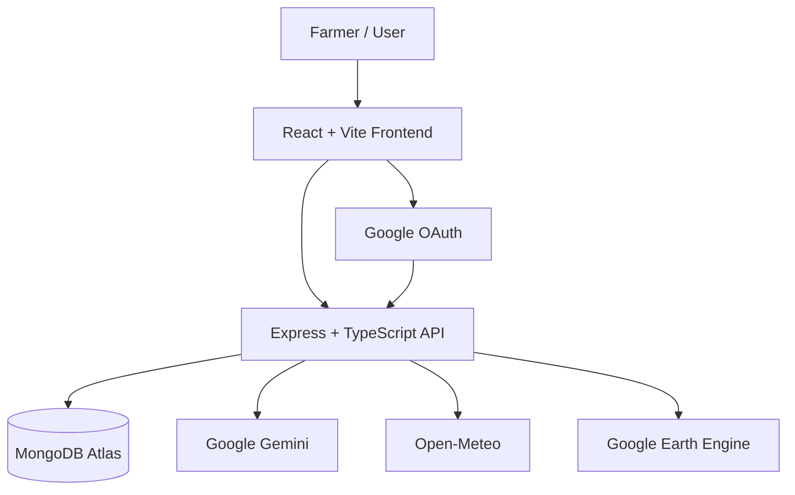
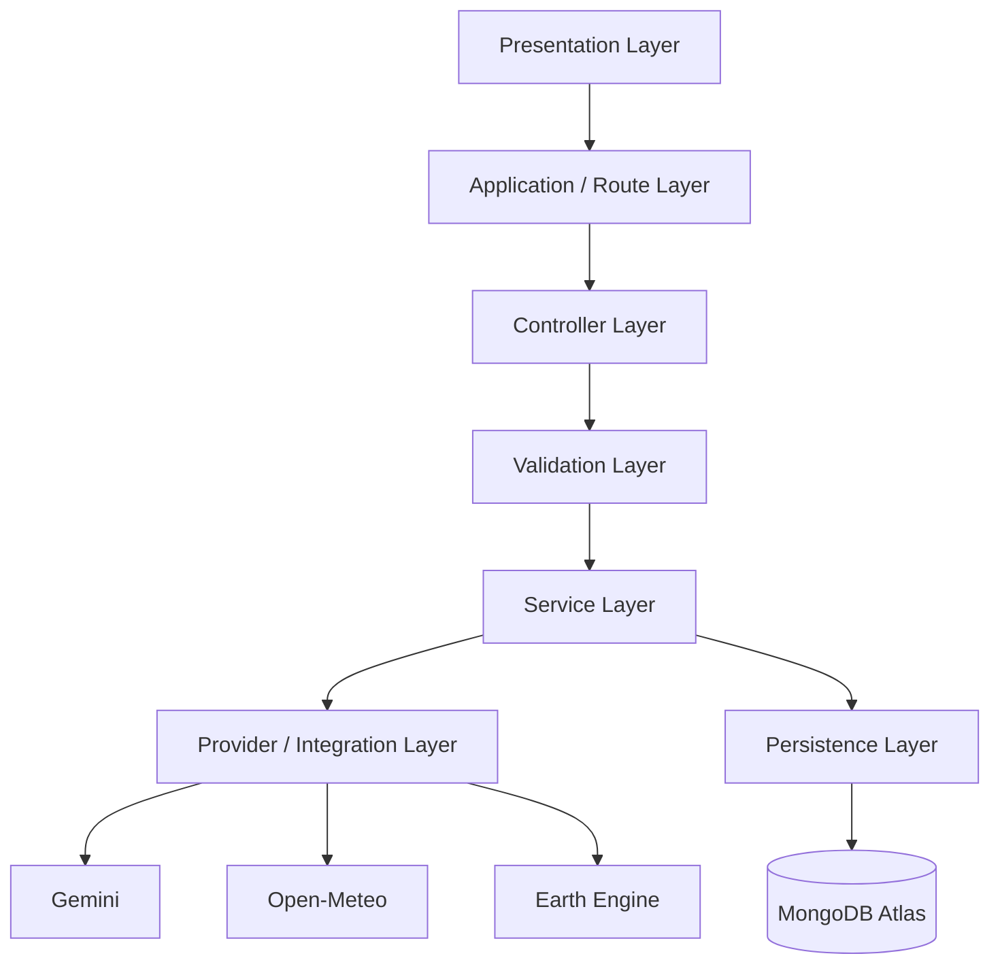
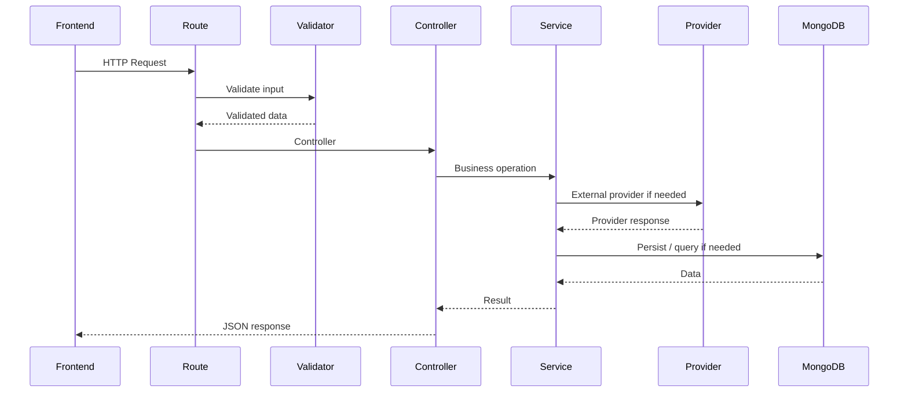
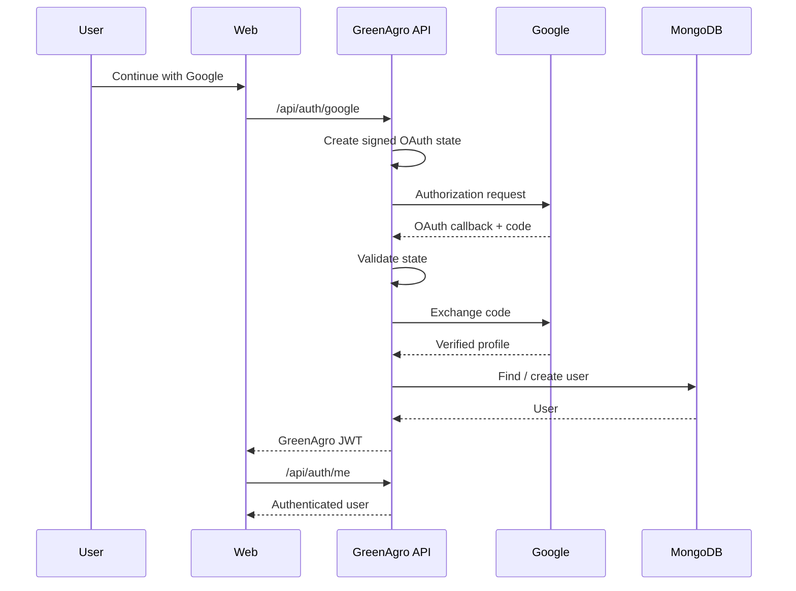
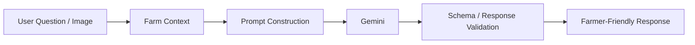
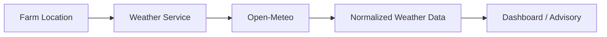
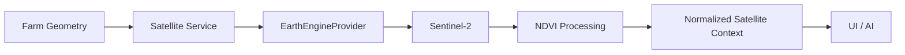
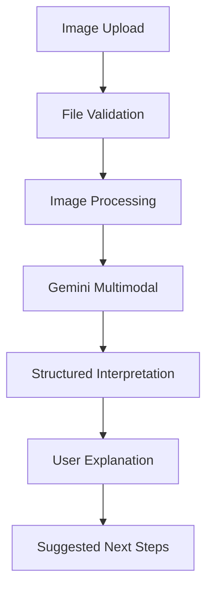
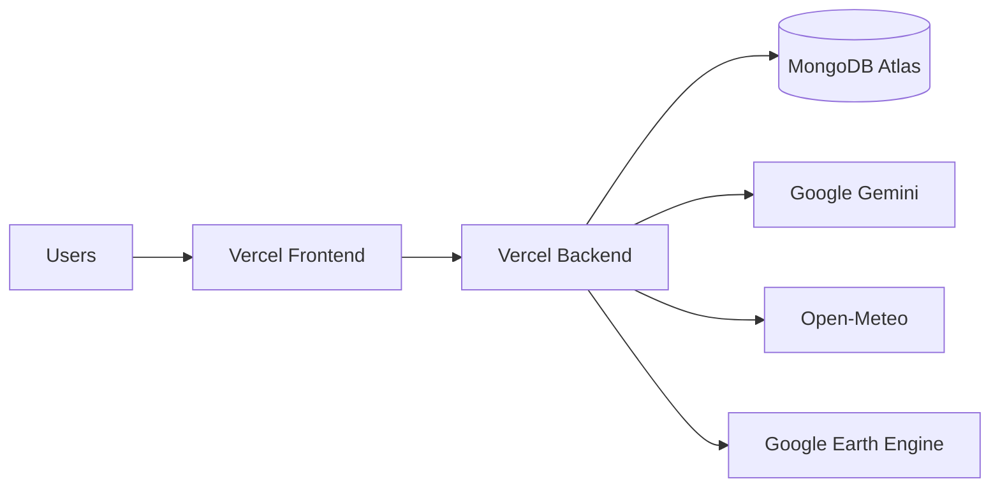

# ⚙️ GreenAgro — Technical Requirements Document

> **Technical architecture, integrations, data contracts, security and deployment requirements**

---

## 01 — System Overview

| Area | Technology / Approach |
|---|---|
| Frontend | React + TypeScript + Vite |
| UI | Tailwind CSS |
| Routing | React Router |
| Forms | React Hook Form + Zod |
| Visualization | Recharts |
| Icons | Lucide React |
| Backend | Node.js + Express + TypeScript |
| Database | MongoDB Atlas + Mongoose |
| AI | Google Gemini |
| Weather | Open-Meteo |
| Satellite | Google Earth Engine + Sentinel-2 / NDVI |
| Authentication | JWT + Google OAuth |
| Frontend Deployment | Vercel |
| Backend Deployment | Vercel |

---

## 02 — High-Level Architecture



---

## 03 — Layered Architecture



### Architectural Rule

Business logic should live in services rather than being duplicated inside route handlers.

---

## 04 — Frontend Architecture

Expected frontend organization:

```text
apps/web/src/
├── components/
├── pages/
├── layouts/
├── hooks/
├── services/
├── i18n/
├── types/
├── main.tsx
├── App.tsx
├── routes.tsx
└── index.css
```

### Responsibilities

**Pages**
- Screen-level composition.
- Loading and error states.
- Route-specific interaction.

**Components**
- Reusable UI.
- Cards.
- Navigation.
- Dialogs.
- Forms.
- Visualizations.

**Services**
- API calls.
- Authentication.
- Weather.
- Satellite.
- AI interactions.

**Types**
- Shared frontend data contracts.

---

## 05 — Backend Architecture

Expected backend organization:

```text
apps/api/src/
├── config/
├── controllers/
├── middleware/
├── models/
├── routes/
├── services/
│   ├── ai/
│   ├── weather/
│   ├── satellite/
│   ├── soil/
│   ├── disease/
│   ├── advisory/
│   ├── regenerative/
│   ├── knowledge/
│   └── auth/
├── validators/
├── utils/
├── types/
├── jobs/
├── seed/
├── app.ts
└── server.ts
```

---

## 06 — API Request Flow



---

## 07 — API Areas

| Area | Purpose |
|---|---|
| `/api/auth` | Authentication and user profile |
| `/api/farms` | Farm context and farm operations |
| `/api/weather` | Weather provider access |
| `/api/satellite` | Satellite / NDVI access |
| `/api/soil` | Soil health data |
| `/api/disease` | Crop image analysis |
| `/api/advisory` | Contextual advisory |
| `/api/regenerative` | Regenerative recommendations |
| `/api/knowledge` | BRICS knowledge exchange |

---

## 08 — Authentication Architecture



### OAuth State Requirement

The backend uses signed state validation because serverless deployments can route separate requests to different runtime instances.

The state should include:

- Random nonce
- Timestamp
- Cryptographic signature

Replay protection should be applied where possible.

---

## 09 — MongoDB Requirements

MongoDB Atlas is the primary persistence layer.

### User Data

The user model supports fields such as:

```text
name
email
phone
password
role
location
language
avatarUrl
preferences
googleId
```

### Preferences

```text
weatherAlerts
diseaseAlerts
weeklyReports
marketUpdates
```

### Knowledge Data

Knowledge records support:

```text
practiceId
title
country
region
crop
climateZone
description
practiceDetails
expectedBenefit
tags
imageUrl
views
likes
adaptationNotes
provenance
```

---

## 10 — AI Architecture



### AI Input

Depending on the workflow, context may include:

- User question
- Farm information
- Crop
- Soil indicators
- Weather context
- Satellite-derived information
- Disease image
- Relevant knowledge

### AI Output

Should be:

- Contextual
- Understandable
- Structured where required
- Explicit about uncertainty
- Free from fabricated measurements

---

## 11 — Weather Integration

Provider:

**Open-Meteo**



The provider response should be normalized before being consumed by UI or AI services.

---

## 12 — Satellite Integration

Provider:

**Google Earth Engine**

Dataset direction:

**Sentinel-2 vegetation information / NDVI**



### Provider Abstraction

```text
SatelliteService
      ↓
SatelliteProvider
      ├── EarthEngineProvider
      └── Future Provider
```

If credentials are unavailable, the API should return a clear provider state rather than fabricated data.

---

## 13 — Disease Analysis



### Upload Requirements

- Validate MIME type.
- Validate file size.
- Reject unsupported formats.
- Handle provider timeout.
- Handle malformed AI response.
- Avoid storing sensitive uploads unnecessarily.

---

## 14 — Soil Intelligence

Soil input normalization should support:

- Nitrogen
- Phosphorus
- Potassium
- pH
- Organic Carbon

```text
Raw Soil Input
      ↓
Unit / Range Validation
      ↓
Normalization
      ↓
Deterministic Interpretation
      ↓
Structured Soil Context
      ↓
Gemini Explanation
```

---

## 15 — Data Provenance Contract

External and derived values should preserve provenance where practical.

```text
source
provider
retrievedAt
dataset
unit
quality
sourceType
```

### Source Type

```text
live_api
public_dataset
derived
demo
cached
```

This allows the UI and advisory layer to distinguish live data from derived or demonstration information.

---

## 16 — Error Handling

### Required Error Categories

| Error | Expected Handling |
|---|---|
| Invalid input | HTTP 400 |
| Unauthenticated | HTTP 401 |
| Unauthorized resource | HTTP 403 |
| Missing resource | HTTP 404 |
| Provider failure | Controlled provider error |
| Validation failure | Structured validation response |
| AI malformed response | Validation + safe fallback |
| External timeout | Clear retryable response |
| Server error | HTTP 500 + safe message |

The UI should display understandable error states rather than raw stack traces.

---

## 17 — Environment Configuration

### Frontend

```env
VITE_API_BASE_URL=https://greenagro-api.vercel.app/api
```

### Backend

```env
NODE_ENV=production
FRONTEND_URL=https://green-agro-ruby.vercel.app

MONGODB_URI=...
JWT_SECRET=...

GEMINI_API_KEY=...

GOOGLE_CLIENT_ID=...
GOOGLE_CLIENT_SECRET=...
GOOGLE_CALLBACK_URL=...

SATELLITE_PROVIDER=earth-engine
EARTH_ENGINE_PROJECT=...
EARTH_ENGINE_CREDENTIALS_JSON=...
```

Values are examples of configuration keys; actual secrets must remain private.

---

## 18 — Production Deployment



### Deployment Rule

Frontend and backend are deployed as **separate Vercel projects**.

---

## 19 — Security Requirements

- No secrets in Git.
- No service-account JSON in source.
- JWT secret stored only in environment.
- OAuth client secret stored only in backend environment.
- CORS must explicitly allow the production frontend.
- Authenticated farm endpoints must verify user ownership.
- Upload endpoints must validate files.
- AI output should be validated before use.
- Error messages must not leak secrets.

---

## 20 — Performance Requirements

The application should:

- Avoid unnecessary repeated provider requests.
- Use loading states.
- Use controlled API calls.
- Handle provider timeouts.
- Avoid blocking the complete UI while non-critical data loads.
- Keep mobile interactions responsive.
- Use caching where appropriate and safe.

---

## 21 — Responsive Requirements

### Desktop

- Sidebar navigation.
- Multi-column information layout.
- Map and data visualization support.

### Mobile

- Bottom navigation.
- Responsive cards.
- No horizontal page overflow.
- Content must not be hidden behind fixed navigation.
- Maps must remain usable.
- AI floating control must not cover essential actions.

---

## 22 — Technical Definition of Done

- Frontend builds successfully.
- Backend builds successfully.
- Production API responds.
- Frontend connects to production API.
- MongoDB connection works.
- Google OAuth works.
- Gemini integration works when configured.
- Weather integration works.
- Satellite provider returns real data when configured or a clear not-configured state.
- Knowledge records load.
- Mobile navigation does not overlap critical content.
